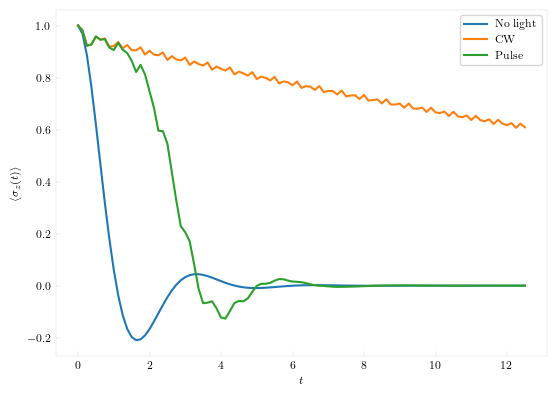

# Dynamics in presence of an external light

It has been shown that dissipative tunneling dynamics can be controlled by continuous wave light. We replicate some of the results here. 

As usual, first, we set up the system:
```julia
using QuantumDynamics
using Plots, LaTeXStrings

H0 = Utilities.create_tls_hamiltonian(; ϵ=0.0, Δ=2.0)        # 1.1 Define the system Hamiltonian
V(t) = 11.96575 * cos(10.0 * t)   # This is the monochromatic light
EF = Utilities.ExternalField(V, [1.0+0.0im 0.0; 0.0 -1.0])
Jw = SpectralDensities.ExponentialCutoff(; ξ=0.16, ωc=7.5)    # 1.2 Define the spectral density
β = 0.5    # 1.3 Inverse temperature
```

Calculate the forward-backward propagators. For the case with the external field, we use the `Propagators.calculate_bare_propagators_external_field` function.
```julia
dt = 0.125
ntimes = 100
fbU = Propagators.calculate_bare_propagators(; Hamiltonian=H0, dt=dt, ntimes=ntimes, external_fields=[EF])
nofield_fbU = Propagators.calculate_bare_propagators(; Hamiltonian=H0, dt=dt, ntimes=ntimes)
```

Simulate the system with the field. TTM does not yet work with time-dependent Hamiltonians. So, we resort to plain QuAPI.
```julia
ρ0 = [1.0+0.0im 0; 0 0]
tlight, ρlight = TEMPO.propagate(; fbU=fbU, Jw=[Jw], β=β, ρ0=ρ0, dt=dt, ntimes=ntimes, kmax=9)
```

Use TTM to simulate the case without the external field.
```julia
t, ρ = TTM.propagate(; fbU=nofield_fbU, Jw=[Jw], β=β, ρ0=ρ0, dt=dt, ntimes=ntimes, rmax=9, extraargs=QuAPI.QuAPIArgs(), path_integral_routine=QuAPI.build_augmented_propagator)
```

Obtain the Markovian dynamics in presence of light but in absence of the dissipative medium. 
```julia
t_nodissip, ρ_nodissip = Utilities.apply_propagator(; propagators=fbU, ρ0=ρ0, ntimes=ntimes, dt=dt)
```

Finally, we plot all the dynamics both in presence and in absence of light and the dissipative medium.


The localization phenomenon, though not as pronounced as in absence of dissipative media, is still clearly visible. As a comparison, we also simulate the dynamics in presence of a light pulse
```julia
V1(t) = 11.96575 * cos(10.0 * t) * exp(-t^2 / 8)   # This is the light pulse
EF1 = Utilities.ExternalField(V1, [1.0+0.0im 0.0; 0.0 -1.0])
fbU_pulse = Propagators.calculate_bare_propagators(; Hamiltonian=H0, dt=dt, ntimes=ntimes, external_fields=[EF1])
@time t, ρs = QuAPI.propagate(; fbU=fbU_pulse, Jw=[Jw], β=β, ρ0=ρ0, dt=dt, ntimes=ntimes, kmax=9)
sigma_z_pulse = real.(ρs[:,1,1] .- ρs[:,2,2])
```

Now, we show the results.
