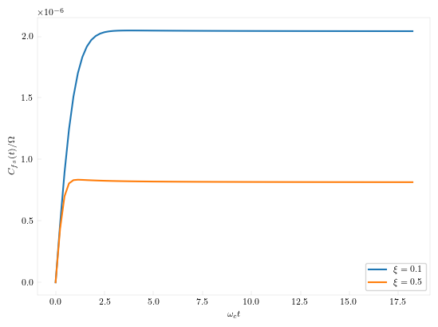

# Quantum Correlation Functions

Thermal correlation functions for open quantum systems can be calculated using complex time path integral. QuantumDynamics.jl implements both the [original path integral methodology](https://doi.org/10.1063/1.468244) and the newer [tensor network approach](https://doi.org/10.1063/5.0174338).

## Basic Rate Theory
Below is an example of using the tensor network approach to calculate the rate using the flux-side correlation function.

```julia
using QuantumDynamics

invcm2au = 4.55633e-6

H = Matrix{ComplexF64}([
    0.0 0.000525
    0.000525 0.0
]) * invcm2au

β = 87.7899537566
svec = [1.0 -1.0]

state1 = [1.0 0.0; 0.0 0.0]
A = 1im * Utilities.commutator(H, state1)
B = copy(state1)
idmat = [1.0 0.0; 0.0 1.0]

Jw = [SpectralDensities.ExponentialCutoff(; ξ=0.1, ωc=500invcm2au)]
At, avgbond = ComplexTNPI.A_of_t(; Hamiltonian=H, β, t=0.0, N=50, Jw, svec, A=idmat)
Q = real(tr(At*state1))
time_xi01, corr_xi01, avg_bond_dim_xi01 = ComplexTNPI.complex_correlation_function(; Hamiltonian=H, β, tfinal=8000.0, dt=100.0, N=50, Jw, svec, A, B=[B], Z=Q, verbose=true, extraargs=Utilities.TensorNetworkArgs())

Jw = [SpectralDensities.ExponentialCutoff(; ξ=0.5, ωc=500invcm2au)]
At, avgbond = ComplexTNPI.A_of_t(; Hamiltonian=H, β, t=0.0, N=50, Jw, svec, A=idmat)
Q = real(tr(At*state1))
time_xi05, corr_xi05, avg_bond_dim_xi05 = ComplexTNPI.complex_correlation_function(; Hamiltonian=H, β, tfinal=8000.0, dt=100.0, N=50, Jw, svec, A, B=[B], Z=Q, verbose=true, extraargs=Utilities.TensorNetworkArgs())
```



